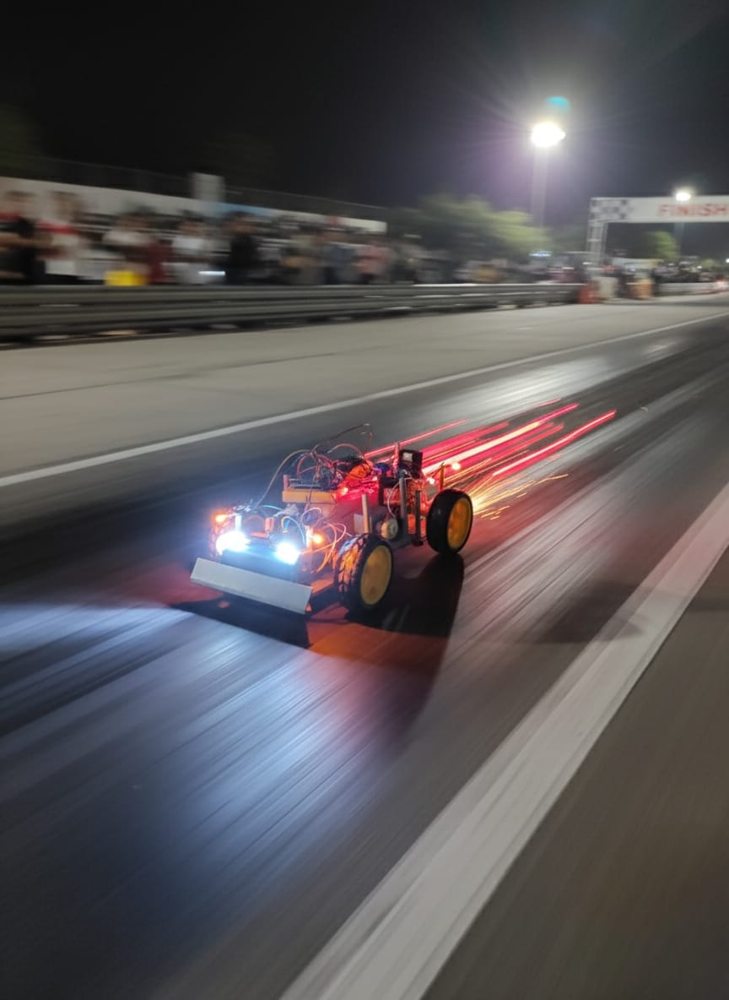
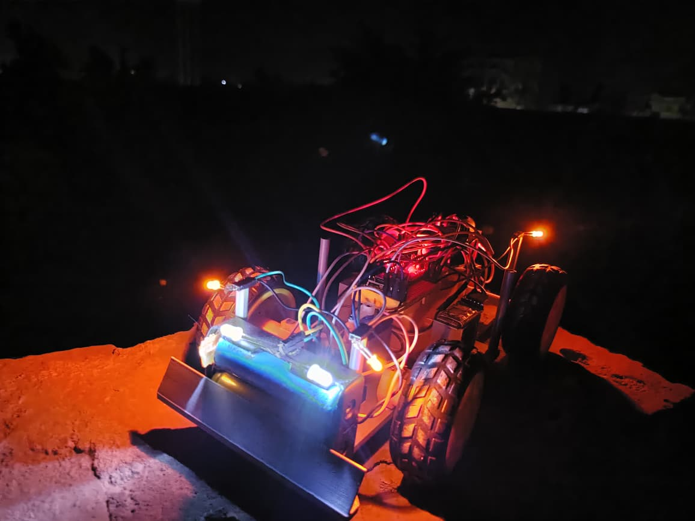

# Arduino Bluetooth RC Car Controller

A comprehensive Arduino-based remote control car system with advanced lighting features, speed control, and Bluetooth communication.

---

## 📋 Project Overview

This project implements a fully-featured RC car controller using Arduino, L298N motor driver, servo motor for steering, and Bluetooth connectivity. The system includes intelligent lighting that responds to the car's movement state, providing realistic turn signals, headlights, and brake lights.

---

## ✨ Features

- **Bluetooth Control**: Wireless control via Bluetooth serial communication
- **4-Speed System**: Four selectable speed levels (90, 140, 200, 255 PWM)
- **Smart Steering**: Servo-controlled front wheel steering with precise angle control
- **Intelligent Lighting System**:
  - Automatic headlights when moving forward
  - Brake lights when reversing
  - Turn signals that activate based on steering angle
  - Emergency blink mode when stopped
  - Complete lighting on/off control
- **Horn Function**: Integrated buzzer for horn sounds
- **Multi-directional Movement**: Forward, backward, left, right, and diagonal movements

---

## 🔧 Hardware Requirements

### Components:
- **Arduino Board** (Uno/Nano recommended)
- **L298N Motor Driver Module**
- **Servo Motor** (for steering)
- **DC Motor** (for rear wheel drive)
- **HC-05/HC-06 Bluetooth Module**
- **Buzzer** (for horn)
- **4x LEDs** (front, back, left turn signal, right turn signal)
- **Power Supply** (compatible with your motors)
- **Resistors** (appropriate for LEDs)

### Pin Configuration:

| Component | Arduino Pin |
|-----------|-------------|
| Motor IN1 (L298N) | 5 |
| Motor IN2 (L298N) | 6 |
| Motor ENA (PWM) | 11 |
| Steering Servo | 10 |
| Buzzer | 2 |
| Back LED | 3 |
| Front LED | 8 |
| Right Turn Signal | 4 |
| Left Turn Signal | 7 |

---

## 📡 Bluetooth Commands

### Speed Control:
- `'1'` → Speed 90 (Slow)
- `'2'` → Speed 140 (Medium)
- `'3'` → Speed 200 (Fast)
- `'4'` → Speed 255 (Maximum)

### Movement Control:
- `'F'` → Forward
- `'B'` → Backward
- `'L'` → Turn Left (steering only)
- `'R'` → Turn Right (steering only)
- `'G'` → Forward + Left
- `'H'` → Forward + Right
- `'I'` → Backward + Left
- `'J'` → Backward + Right
- `'S'` → Stop

### Additional Features:
- `'Y'` → Horn (200ms beep)
- `'U'` → Lights OFF
- `'u'` → Lights ON

---

## 🚦 Lighting System Behavior

### Forward Mode:
- Front LED: **ON**
- Back LED: **OFF**
- Turn signals blink (400ms interval) based on steering angle

### Backward Mode:
- Front LED: **OFF**
- Back LED: **ON** (brake light)
- Turn signals blink based on steering angle

### Stop Mode:
- Alternating blink pattern between front/back and left/right signals
- Creates an attention-grabbing emergency pattern

### Lights OFF Mode:
- All LEDs disabled regardless of car state

---

## 🎯 Steering Configuration

- **Center Position**: 90°
- **Left Turn Angle**: 65°
- **Right Turn Angle**: 115°
- **Detection Tolerance**: ±5° for turn signal activation

---

## 🚀 Setup Instructions

1. **Hardware Assembly**:
   - Connect all components according to the pin configuration table
   - Ensure proper power supply connections to L298N and Arduino
   - Connect Bluetooth module to Arduino TX/RX pins

2. **Software Setup**:
   - Install Arduino IDE
   - Install Servo library (usually pre-installed)
   - Upload the code to your Arduino board

3. **Bluetooth Pairing**:
   - Pair your device with the Bluetooth module (default PIN usually 1234 or 0000)
   - Use a Bluetooth serial terminal app to send commands

4. **Calibration**:
   - Adjust `Left` and `right` variables if needed for optimal steering angles
   - Modify speed values in case statements to match your motor specifications

---

## 📝 Code Structure

### Main Functions:

- **`setup()`**: Initializes all pins, servo, and serial communication
- **`loop()`**: Main control loop handling command processing and light management
- **`handleLights()`**: Manages all lighting logic based on car state

### Key Variables:

- `carState`: Tracks current movement state ('F', 'B', 'S')
- `lightMode`: Boolean flag for master light control
- `speed`: Current PWM speed value
- `bluetoothData`: Stores incoming Bluetooth commands

---

## 🎓 Author

**Ahmed Mohamed Attia**  
*Communications & Electronics Engineering Student*  
Zagazig University – Faculty of Engineering

### 🌐 Connect With Me:
- 📂 **GitHub**: [Ahm3d0x](https://github.com/Ahm3d0x)  
- 💼 **LinkedIn**: [Ahmed M. Attia](https://linkedin.com/in/ahmed-m-attia-757aa6292)  
- 📧 **Email**: [ahm3d.m.attia@gmail.com](mailto:ahm3d.m.attia@gmail.com)

---

## 📄 License

This project is open-source and available for educational purposes.

---

## 🔮 Future Enhancements

- [ ] Obstacle detection using ultrasonic sensors
- [ ] Speed feedback using encoders
- [ ] Battery voltage monitoring
- [ ] Mobile app with custom UI
- [ ] Autonomous driving modes

---

## 🤝 Contributing

Feel free to fork this project, submit issues, or create pull requests for improvements!

---
